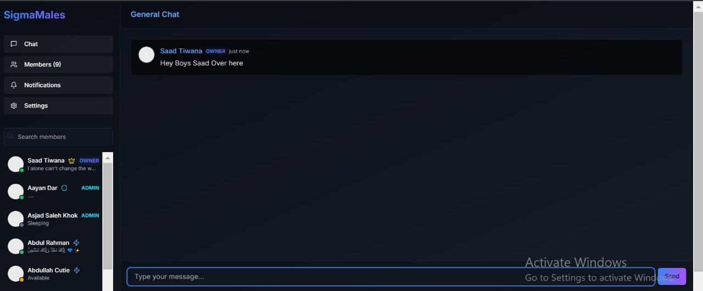

# SigmaMales Chat Platform

\# sigmamales-chat  

Basic React Chat App (Not fully Functional)  

## 📷 Preview  

  

---

## 🚀 Features  

- **Futuristic UI**: Neon-accented, cyberpunk-themed glass-morphism design  
- **Real-Time Chat**: Instant messaging with seamless communication  
- **User Roles**:  
  - **Owner**: Full control over the platform  
  - **Admin**: Moderation privileges  
  - **Member**: Standard chat functionalities  
- **Member Search & Status Indicators**: Find users quickly and view their activity status  
- **Responsive Design**: Optimized for both desktop and mobile  
- **Cyberpunk Animations**: Smooth, high-tech hover effects and transitions  

---

## 🛠️ Tech Stack  

- **Frontend**: React 18 + TypeScript  
- **Styling**: Tailwind CSS, Shadcn UI  
- **Icons**: Lucide React  
- **Real-Time Chat**: AI SDK integration  

---

## 🏗️ Project Structure  

```
SigmaMales-Chat/
├── src/
│   ├── components/    # Reusable UI components
│   ├── pages/         # Main application pages
│   ├── styles/        # Global styles and Tailwind configuration
│   ├── utils/         # Utility functions and helpers
│   ├── assets/        # Icons, images, and static files
│   └── hooks/         # Custom React hooks
├── public/            # Static files
├── package.json       # Project dependencies and scripts
└── README.md          # Project documentation
```

---

## 🎨 Design Choices  

The **SigmaMales Chat Platform** is built with a high-tech aesthetic in mind:  

- **Dark Theme**: Neon blue and purple accents for a futuristic look  
- **Glass-Morphism**: Depth effects for a sleek, modern UI  
- **Custom Animations**: Smooth transitions and hover effects  
- **Gradient Texts & Backgrounds**: Enhancing the cyberpunk aesthetic  
- **Minimalistic Inputs**: Clean, sleek text fields with cyber styling  

---

## 🚀 Getting Started  

1. **Clone the repository**  
   ```sh
   git clone https://github.com/saadhtiwana/sigmamales-chat.git
   cd sigmamales-chat
   ```
2. **Install dependencies**  
   ```sh
   npm install
   ```
3. **Start the development server**  
   ```sh
   npm start
   ```

---

## 👥 Contributors  

- **Saad Tiwana** (Owner)  
  - GitHub: [saadhtiwana](https://github.com/saadhtiwana)  
  - Email: [saadhayat799@gmail.com](mailto:saadhayat799@gmail.com)  

Contributions are welcome! Feel free to submit a PR or open an issue.  

---

## 📄 License  

This project is licensed under the **MIT License**.  

---

> **"Chat like a Sigma, rule like a Sigma."** 🦾🔥  

